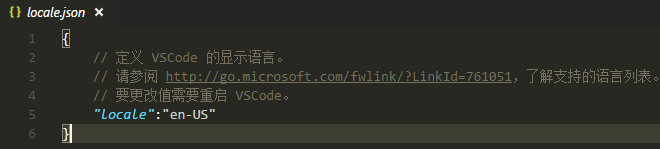
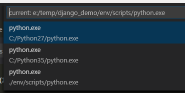
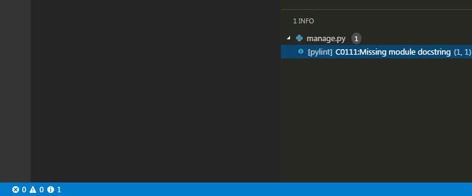

如何使用Visual Studio Code开发Django项目
========================================

如何获得 Visual Studio Code
---------------------------
访问 http://code.visualstudio.com 下载并安装。

前提条件
--------

安装Python 2.7 及 Python 3.5，Windows下可以安装至 c:\python27 及 c:\python35。注意环境变量PATH的设置，建议只在PATH中添加一个版本的Python路径。Python 安装完后需要使用pip命令安装virtualenv模块，该模块负责隔离不同项目开发之间的模块依赖。

在安装完后，如果是Windows操作系统，可以在%USERPROFILE%下创建pip文件夹，并在该文件夹内创建包含以下内容的pip.ini文件，该文件的作用是让pip命令通过阿里云的镜像站点安装Python模块。
::

    [global]
    index-url = http://mirrors.aliyun.com/pypi/simple/

    [install]
    trusted-host = mirrors.aliyun.com

如何将Visual Studio Code配置成Django项目开发环境
------------------------------------------------

推荐在Windows下使用cmder作为首选命令行工具，配合最新版Git客户端使用，即可在Windows下使用linux命令的移植版本。项目文件夹可为d:\repos。

通常vscode应该以文件夹的形式打开项目，可以在cmder中通过cd命令切换目录至项目文件夹，例如d:\repos\demo，然后再执行 code . 打开项目。

推荐将vscode界面语言配置成英文，方式为在vscode窗口中按下 Ctrl + Shift + P，输入 语言，选择配置语言，再打开的配置文件中，将locale设置为en-US

安装插件
^^^^^^^^

#. 打开 vscode，按下 Ctrl + Shift + X 打开插件管理侧边栏。
#. 依次安装下列插件

::

    Git history
    Python
    Django Template
    jquery Code Snippets
    Bootstrap 3 Snippets

创建Django测试项目并进行配置
----------------------------

VS Code提供了两种范围的设置，分别是User及Workspace. 用户级别的设置可以理解为全局设置，其中的设置对任一vscode实例都生效。工作区级别的设置则仅针对当前项目生效，配置文件存放在项目的 .vscode 文件夹中。一般在项目开发中我们使用工作区级别的设置。以下步骤记录了如何建立Django项目的基本目录结构。

#. 创建项目文件夹，例如 mkdir e:\temp\django_demo，并当前目录切换到该文件夹
#. 在项目文件夹中使用virtualenv env 创建env文件夹
#. 创建 requirements.txt 文件，文件中添加以下内容，pylint为python的静态语法检测器，pylint-django 是适用于django项目的语法检查其插件，autopep8 是代码格式化工具

::

    django<1.10
    pylint
    pylint-django
    autopep8

#. 执行 env\\Scripts\\activate.bat 激活虚拟环境
#. 执行 pip install -r requirements.txt 安装相关模块
#. 执行 django-admin startproject demo . 在当前目录下创建django项目文件夹
#. 执行 python manage.py startapp web 新建django app
#. 执行 code . 在当前配置打开项目
#. 在 vscode 中按下 Ctrl + Shift + P，输入 select，选择 Python: Select Workspace Interpreter，在出现的选项中将Python解析器指向env文件夹中的python

7. 在 vscode 中按下 Ctrl + Shift + P，输入 workspace，选择 Preferences: Open Workspace Settings，配置完成后的JSON文件如下
::

    {
        "python.pythonPath": "e:/temp/django_demo/env/scripts/python.exe",
        "python.linting.pylintPath": "pylint",
        "python.linting.pylintArgs": [
            "--load-plugins", "pylint_django"
        ],
        "python.formatting.autopep8Path": "autopep8"
    }

8. 成功配置完成后，vscode 会在状态栏中提示代码是否符合 pylint的相关规则。之后我们可以在此基础上继续项目开发。

